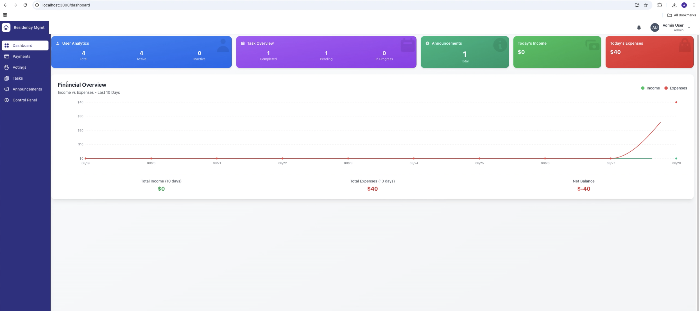
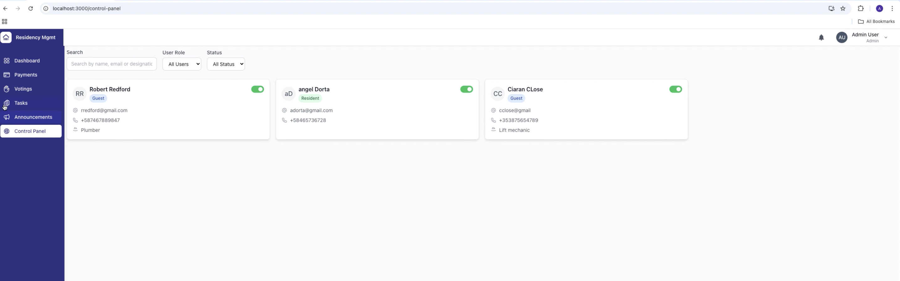

# UnityCondos

**Bridging trust gaps in communal living across Latin America**

---

## Project Overview

UnityCondos is a full-stack web application designed to streamline property management for residential communities—such as condominiums and apartment complexes—especially in Latin America, where building administration is often informal and handled by the residents. The platform addresses challenges of transparency, participation and trust by providing a centralized system for communication, task coordination, financial tracking and decision-making.

> **Motivation:**  
> Unlike many regions with professional property management, Latin American communities often rely on residents to manage finances, maintenance and communication typically using informal tools like WhatsApp and spreadsheets. UnityCondos formalizes and modernizes these processes to reduce conflict, promote accountability and improve quality of life.

---

## Key Features

- **Transparent Fund Management:**  
  Real-time financial dashboards, shared ledgers, and receipt uploads for accountability.

- **Integrated Communication:**  
  Announcements, notifications, and a shared calendar for meetings, repairs, and events.

- **In-App Voting:**  
  Proposals and polls to facilitate collective decision-making.

- **Task Assignment & Rotation:**  
  Assign, track, and rotate building maintenance tasks among residents or external contractors.

- **Incident Reporting:**  
  Simple submission and tracking of maintenance or security issues.

- **Role-Based Access:**  
  Admin, Resident, and Guest (contractor) roles with tailored permissions.

- **Auditability:**  
  Detailed activity logs, announcement view tracking, and payment summaries.

---

## Tech Stack

- **Backend:** Java 17, Spring Boot (Web, Security, JPA, Validation, WebSockets)
- **Frontend:** React (JavaScript)
- **Database:** MySQL (with support for H2 for development/testing)
- **Authentication:** JWT-based stateless authentication
- **Real-Time:** WebSockets (STOMP & SockJS)
- **DevOps:** Docker, Swagger/OpenAPI for API docs

---

## Architecture

- **RESTful API:** Modular, role-based endpoints for users, announcements, tasks, payments, notifications, and voting.
- **WebSockets:** Real-time notifications for key events (e.g., announcements, task updates).
- **Domain Model:** Explicit entities for Users, Tasks, Payments, Announcements, Polls, Votes, File Uploads (receipts), and more.
- **Security:** JWT Bearer tokens with granular role authorization (Admin/Resident/Guest).
- **Frontend:** Mobile-first, intuitive UI for non-technical users.

---

## Getting Started

### Prerequisites

- Java 17+
- Node.js & npm
- MySQL (or use H2 for testing)
- Docker (optional, for containerized setup)

### Quickstart (Docker)

1. **Clone the repository:**
   ```bash
   git clone https://github.com/Andorta/UnityCondos.git
   cd UnityCondos
   ```
2. **Copy & edit environment/config files as needed.**
3. **Run with Docker Compose:**
   ```bash
   docker-compose up --build
   ```
   This will spin up the backend, frontend, and database containers.

4. **Access the app:**  
   - Frontend: `http://localhost:3000`  
   - API Docs (Swagger): `http://localhost:8080/swagger-ui.html`

### Manual Setup

#### Backend

```bash
cd backend
./mvnw spring-boot:run
```
- Configure DB settings in `src/main/resources/application.properties`
- API docs at `/swagger-ui.html`

#### Frontend

```bash
cd frontend
npm install
npm start
```

---

## Screenshots

**Dashboard Overview**  


**Control Panel**  


**Task Assignment**  


---

## Contributing

Contributions are welcome! Please open an issue or submit a pull request for bug fixes, improvements, or new features. For major changes, discuss them in advance.


---

## Acknowledgements

Inspired by the self-organizing communities of Latin America and designed to address real-world challenges in property management for markets that tend to be underserved

---

*For questions or suggestions, please contact [Andorta on GitHub](https://github.com/Andorta).*
